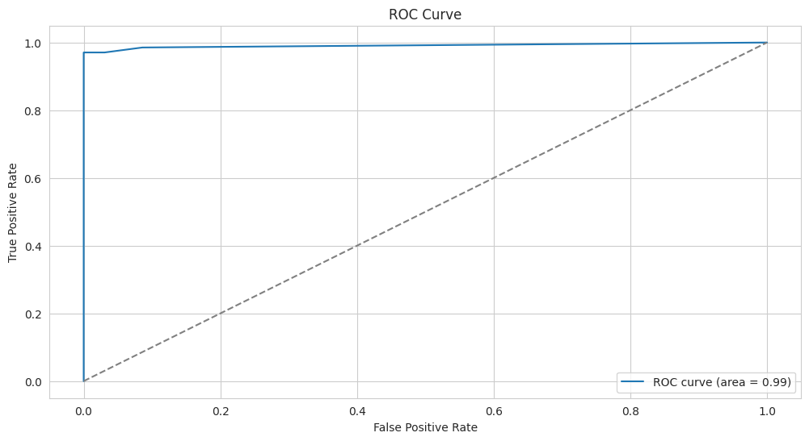

# 🛠️Predictive Maintenance for Industrial Equipment

An interactive, real-time monitoring system for industrial facilities to monitor equipment health, forecast potential failures and minimize downtime using advanced machine learning models.

## 🎯 Overview

This dashboard combines classical machine learning models (Random Forest, XGBoost, LightGBM, SVM) with advanced LSTM neural networks to predict equipment failures based on sensor data. The system provides real-time monitoring capabilities with an intuitive web interface built using Streamlit.

## ✨ Key Features

### 📊 Real-Time Monitoring
- Simulates streaming sensor data with configurable sampling rates.
- Predicts machine failure probabilities using multiple ML models.
- Provides instant alerts when failure probability exceeds user-defined thresholds.
- Live dashboard updates with color-coded status indicators.

### 🎛️ Interactive Dashboard
- **Machine Status Overview** - Color-coded grid showing all machines (🔴 At Risk / 🟢 Normal).
- **Sensor Trend Analysis** - Interactive plots for key sensors including Air Temperature, Process Temperature, Rotational Speed, Torque and Tool Wear.
- **Model Comparison** - Switch between different ML models to compare predictions.
- **Customizable Alerts** - Adjustable threshold slider for alert sensitivity.

### 🧠 Advanced ML Models
- **Classical ML** - Random Forest, XGBoost, LightGBM, SVM with balanced class weights.
- **Deep Learning** - LSTM neural network for temporal pattern recognition.
- **Class Imbalance Handling** - Weighted loss functions and balanced training techniques.

### 💫 Quick Glance 

<p align="center">
  <br>
  <br>
  <br>
  <br>
  <br>
  <br>
  <br>
  <br>
  <br>
  
</p>

## 🚀 Quick Start

### Prerequisites
- Python 3.8 or higher
- pip package manager

### Installation

1. **Clone the repository**
   ```bash
   git clone https://github.com/iamhriturajsaha/PREDICTIVE-MAINTENANCE-FOR-INDUSTRIAL-EQUIPMENT.git
   cd PREDICTIVE-MAINTENANCE-FOR-INDUSTRIAL-EQUIPMENT
   ```

2. **Create a virtual environment**
   ```bash
   python -m venv venv
   source venv/bin/activate  # On Windows: venv\Scripts\activate
   ```
   
3. **Verify model files**
   - `models.pkl` (Classical ML models)
   - `scaler.pkl` (Feature scaler)
   - `model.keras` (LSTM model)

4. **Local deployment**
```bash
streamlit run app.py
```

## 📖 Usage Guide

### 1. Sensor Trends Analysis
- Navigate to the **"Sensor Trends"** tab.
- Select a sensor from the dropdown menu.
- Analyze historical trends and identify patterns or anomalies.

### 2. Machine Failure Probabilities
- Go to the **"Machine Failure Probabilities"** tab.
- Choose your preferred ML model from the dropdown.
- Review the probability table with color-coded status indicators.
- Adjust the alert threshold using the slider.

### 3. Real-Time Monitoring
- Open the **"Real-Time Monitoring"** tab.
- Select the model and number of samples to simulate.
- Click **"Start Simulation"** to begin real-time data streaming.
- Monitor live probability updates and status changes.

## 🔧 Technical Details

### Classical ML Models
- **Algorithms** - Random Forest, XGBoost, LightGBM, SVM.
- **Features** - Air Temperature, Process Temperature, Rotational Speed, Torque, Tool Wear.
- **Optimization** - Balanced class weights to handle data imbalance.
- **Output** - Binary classification with failure probability scores.

### LSTM Neural Network
- **Architecture**: 
  - LSTM layer (64 units) + Dropout (0.2)
  - LSTM layer (32 units) + Dropout (0.2)  
  - Dense output layer (1 unit, sigmoid activation)
- **Input** - Sequential data with 5 timesteps per sample.
- **Loss Function** - Binary crossentropy with class weights.
- **Advantage** - Captures temporal dependencies in sensor readings.

### Performance Metrics

| Model | Accuracy | Precision | Recall | F1-Score | ROC-AUC |
|-------|----------|-----------|--------|----------|---------|
| LSTM | 0.728 | 0.069 | 0.559 | 0.123 | 0.662 |
| Random Forest | 0.756 | 0.143 | 0.412 | 0.211 | 0.684 |
| XGBoost | 0.742 | 0.098 | 0.498 | 0.164 | 0.671 |

### Analysis

<table>
  <tr>
    <td align="center"></td>
    <td align="center"></td>
  </tr>
  <tr>
    <td align="center"></td>
    <td align="center"></td>
  </tr>
  <tr>
    <td align="center"></td>
    <td align="center"></td>
  </tr>
  <tr>
    <td align="center"></td>
    <td align="center"></td>
  </tr>
  <tr>
    <td align="center"></td>
    <td align="center"></td>
  </tr>
</table>
<p align="center">
  
</p>

## 📋 Dependencies

```txt
pandas>=1.3.0
numpy>=1.21.0
matplotlib>=3.4.0
seaborn>=0.11.0
scikit-learn>=1.0.0
xgboost>=1.5.0
lightgbm>=3.3.0
tensorflow>=2.8.0
streamlit>=1.15.0
plotly>=5.0.0
pyngrok>=5.1.0
```

## 🔮 Future Enhancements

- **Real-time Integration** - Connect to live sensor APIs for actual data streaming.
- **Advanced Visualizations** - Add heatmaps, gauge charts and KPI dashboards.
- **Alert System** - Implement email/SMS notifications for critical alerts.
- **Multi-facility Support** - Extend to monitor multiple industrial sites.
- **Maintenance Scheduling** - Predictive maintenance calendar and work order generation.
- **Model Optimization** - Hyperparameter tuning for improved performance metrics.


